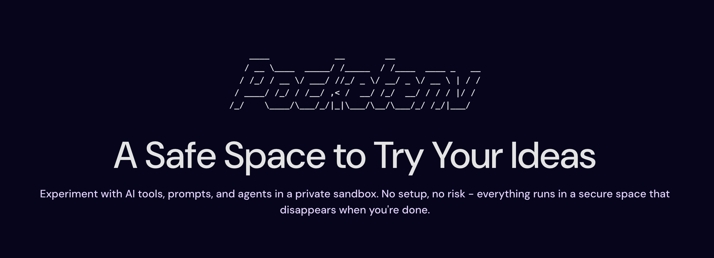

# Pocketenv

an open, interoperable sandbox platform for agents and humans.
Run code, test ideas, and prototype safely in isolated environments — without worrying about vendor lock-in.

> [!NOTE]
> **Still in development**
>
> This project is in early development. Expect breaking changes and rapid iteration.

## Why Pocketenv?

Modern sandboxes are fragmented and vendor-specific. Each platform has its own API, its own format, and its own ecosystem.

Pocketenv solves this by providing:
- A unified sandbox interface
- Open, portable sandbox definitions
- Vendor-agnostic execution
- Interoperability via AT Protocol lexicons
- A platform designed for both AI agents and humans

With Pocketenv, sandboxes become portable, shareable, and open.

## Key Features

### Secure isolated environments

Run commands, agents, and code safely in isolated sandboxes.

### Vendor-agnostic abstraction

Pocketenv can run sandboxes on different providers transparently:
- Daytona
- Cloudflare Sandbox
- Vercel Sandbox
- Deno Sandbox
- And more to come!

No provider lock-in.

### Agent-native design

Pocketenv is designed for AI workflows:
- Run OpenClaw
- Run Codex CLI
- Run Claude Code
- Run Gemini CLI
- Run Copilot CLI
- Run custom agents

### Open sandbox definitions via AT Protocol

Sandboxes are defined using open lexicons and stored on AT Protocol PDS.

This enables:
- Discoverable sandboxes
- Shareable sandboxes
- Versioned sandboxes
- Community ecosystem

### Example Use Cases
- Prototype AI agents safely
- Run Codex / Claude / Gemini in isolation
- Test untrusted code securely
- Share reproducible dev environments
- Run temporary dev environments
- Provide sandbox infrastructure for your app
