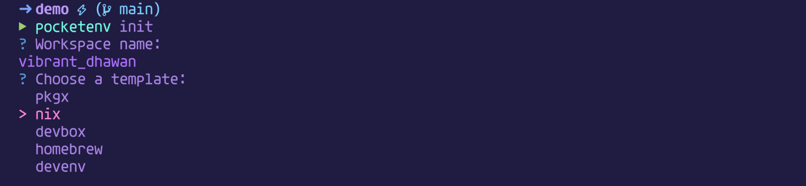

[](https://emoji.gg/emoji/pokeball)

# Pocketenv

[](https://flakehub.com/flake/pocketenv-io/pocketenv)
[](https://builtwithnix.org)
[](https://deno.land/x/pocketenv)

[](https://flakestry.dev/flake/github/pocketenv-io/pocketenv)

Pocketenv is a simple and lightweight tool to manage development workspace environments. It allows you to define and manage workspaces for your projects, and easily switch between them.



> [!NOTE]
> * `Pocketenv Workspaces` are just Docker Containers with some preinstalled tools, volumes, and [vscode tunnel](https://code.visualstudio.com/docs/remote/tunnels) as an entry point.
> * `Pocketenv Templates` are just Github Repositories with terraform files to create a new workspace.

> [!IMPORTANT]
> Pocketenv is still in development and not ready for production use.

## 🚚 Installation

With Bash:

```bash
curl -fsSL https://cli.pocketenv.io | bash
```

With [Homebrew](https://brew.sh/) (macOS/Linux):

```sh
brew install pocketenv-io/tap/pocketenv
```

With Deno:

```bash
deno install -A -r https://cli.pocketenv.io -n pocketenv
```

With Nix:

```bash
nix profile install --experimental-features "nix-command flakes" github:pocketenv-io/pocketenv
```

Or download the binary from the [releases page](https://github.com/pocketenv-io/pocketenv/releases) and add it to your PATH.

> [!TIP]
> * Quickly create a new workspace with `pocketenv init` and `pocketenv up` command.
> * Destroy it with `pocketenv down` command.
> * List all workspaces with `pocketenv list` command.
> * Start a shell in a workspace with `pocketenv shell` command.

## 🚀 Usage

```bash
pocketenv --help

Usage:   pocketenv
Version: 0.1.0    

Description:

                                                                         
  .                                                                      
       ____             __        __                                     
      / __ \____  _____/ /_____  / /____  ____ _   __                    
     / /_/ / __ \/ ___/ //_/ _ \/ __/ _ \/ __ \ | / /                    
    / ____/ /_/ / /__/ ,< /  __/ /_/  __/ / / / |/ /                     
   /_/    \____/\___/_/|_|\___/\__/\___/_/ /_/|___/                      
                                                                         
    https://pocketenv.io - Manage your development environment with ease.
                                                                         

Options:

  -h, --help     - Show this help.                            
  -V, --version  - Show the version number for this program.  

Commands:

  init   [name]       - Generate a new Pocketenv workspace      
  up     [workspace]  - Start the Pocketenv workspace           
  down   [workspace]  - Stop the Pocketenv workspace            
  list                - List all Pocketenv workspaces           
  shell  [workspace]  - Start a shell in the Pocketenv workspace
```
