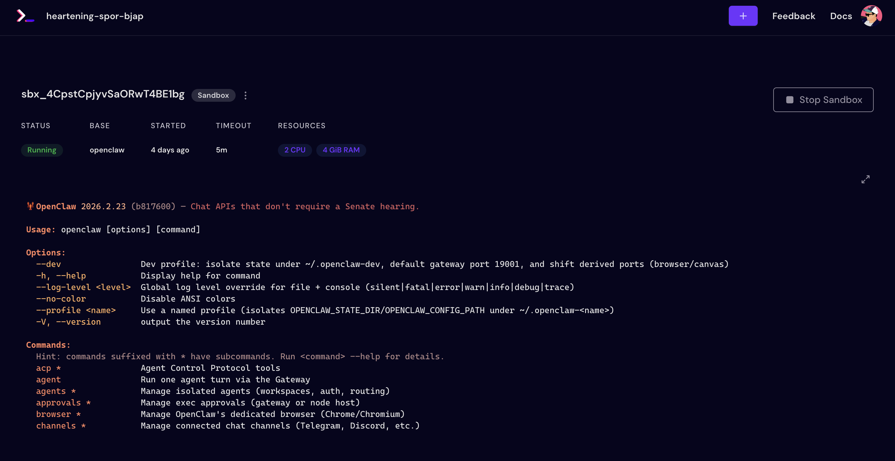

[](https://discord.gg/9ada4pFUFS)

[](https://github.com/pocketenv-io/pocketenv/actions/workflows/deploy.yml)

**Pocketenv** is an open sandbox platform — for agents, for tinkerers, for anyone tired of being locked into one provider's ecosystem.

Spin up isolated environments, run code, test weird ideas. No drama.

<a href="https://pocketenv.io/new?repo=tangled:pocketenv.io/pocketenv" target="_blank"></a>


> [!NOTE]
> **heads up — still in early dev**
>
> Things will break. APIs will change. We move fast. You've been warned (and we appreciate your patience).




---

## Install

**Bash:**
```sh
curl -fsSL https://cli.pocketenv.io | bash
```

**npm:**
```sh
npm install -g @pocketenv/cli
```

**Homebrew (macOS/Linux):**
```sh
brew install pocketenv-io/tap/pocketenv
```

**Nix (Flakes):**
```sh
nix profile install github:pocketenv-io/pocketenv
```

**Arch Linux:**
```sh
yay -Syu pocketenv
```

---

## Why does this exist?

Honestly? Because every sandbox tool out there wants you to commit to their platform. Their API, their format, their rules. Switch providers and you're rewriting everything.

Pocketenv is the escape hatch. One interface, multiple backends — Cloudflare, Daytona, Deno, Vercel, Modal, E2B and more. Write once, run anywhere (for real this time).

It also uses [AT Protocol](https://atproto.com) lexicons under the hood, which means sandbox definitions are open, portable, and not owned by anyone.

---

## Is it for you?

Probably yes if any of these sound familiar:

- You keep spinning up environments and tearing them down manually
- You're building AI agents that need a safe place to run code
- You want to test untrusted code without torching your machine
- You're sick of rewriting glue code every time you switch sandbox providers
- You just want a clean CLI and a reliable environment, no infra headaches

---

## What it can do

**Run sandboxes on whatever backend you want**
Daytona, Cloudflare Sandbox, Vercel Sandbox, Deno Sandbox, Modal, E2B — swap between them without changing your workflow.

**Works with the AI tools you're already using**
Claude Code, Codex CLI, Gemini CLI, Copilot, OpenClaw, your own agents — they all just work.

**Handles the boring stuff**
Env vars, secrets, files, volumes, SSH keys — managed cleanly so you don't have to think about it.

**Open sandbox definitions**
Sandboxes are defined using open lexicons and stored on AT Protocol PDS. That means they're versioned, shareable, and actually portable.

---

## Things people use it for

- Giving AI agents a safe place to run code (without the anxiety)
- Sharing reproducible dev environments with teammates
- Testing third-party or untrusted code in isolation
- Quick throwaway sandboxes for experiments
- Building internal tools that need ephemeral compute

---

## SDKs

- [JavaScript/TypeScript](https://github.com/pocketenv-io/pocketenv-js)
- [Gleam](https://github.com/pocketenv-io/pocketenv-gleam)
- [Clojure](https://github.com/pocketenv-io/pocketenv-clojure)
- [Elixir](https://github.com/pocketenv-io/pocketenv-elixir)

---

## Docs

Full docs over at [docs.pocketenv.io](https://docs.pocketenv.io)

---

## Feedback & bugs

Open an [issue](https://github.com/pocketenv-io/pocketenv/issues/new) or come yell at us (nicely) on [Discord](https://discord.gg/9ada4pFUFS). We read everything.

---

## Contributing

PRs are welcome. Come say hi on [Discord](https://discord.gg/9ada4pFUFS) first if you're planning something big — saves everyone time.

Setup instructions are in [CONTRIBUTING.md](CONTRIBUTING.md).
